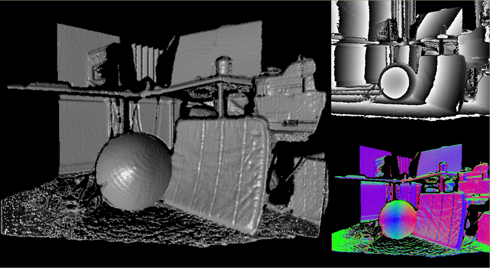
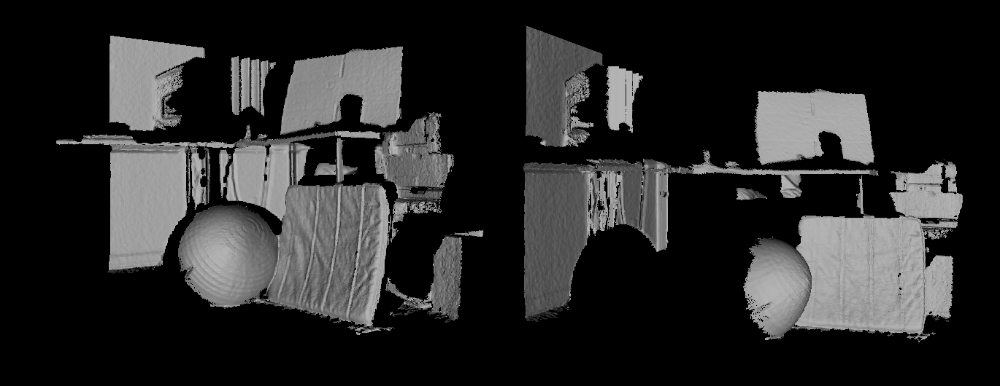
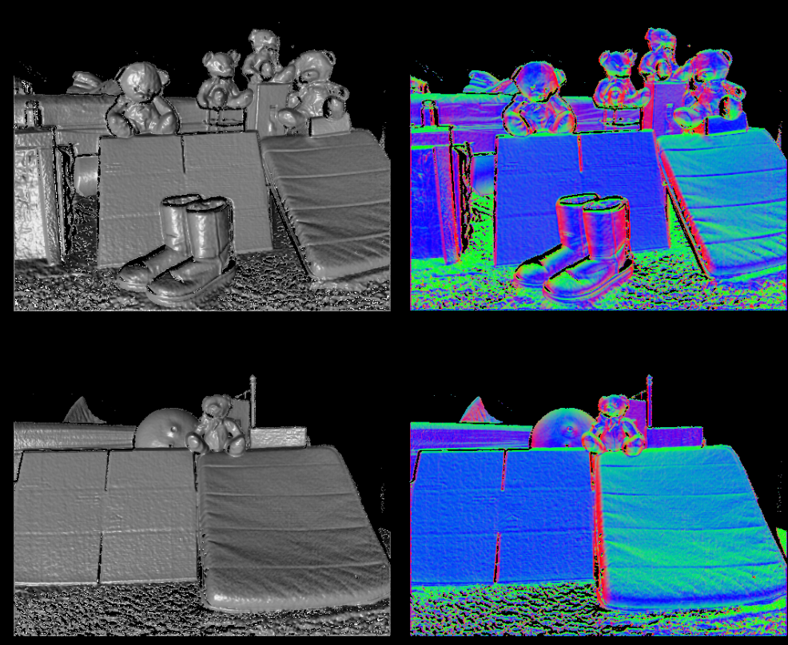

# SLAM Large Dense Scene Real-time 3D Reconstruction
GPU based camera tracking volumetric fusion and rendering.
* Camera Tracking: Track pose in real-time by registering incoming depth image to the TSDF-generated depth map. 
* Volumetric Fusion: With the updated camera pose, fuse the new income depth to the fused TSDF volume in real-time. 
* Volumetric Rendering: Render the fused TSDF volume in real-time.

## GPU Based Real-time RGBD Camera Tracking
### Rigid Iterative Closest Point (ICP) with Point-to-plane Error Metric
To estimate the 6 DoF for camera pose update (3 for rotation and 3 for translation), we use rigid registration algorithm - ICP. The objective function is shown as follow, where s denotes the source vertex position; d denotes its corresponding target vertex position; n denotes the surface normal on target vertex d. [1] The advantage of point-to-plane error metric compared with the point-to-point error metric is the point-to-plane error metric allows two surface to slide over each other, and thus to avoid being trapped into undesired local minima. Comparison of the two can be found in [2].

``` 
For each iteration:
1) We define correspondences projective correspondence (see Projective Correspondence).
2) We derive the optimal transformation T by solving the objective function.
3) We update the pose of source mesh using the optimized T
```

<p align="center">

</p>
<!-- + \bold{T}_{opt} = \arg min_{\bold{T}}\sum_i {\left \|(\bold{T} \cdot \bold{s}_{i} - \bold{d}_{i})\cdot \bold{n}_i }\|_2 + -->
<p align="center">

</p>

### Projective Correspondences

We adopt projection matching to define correspondence. The figure below illustrates the difference between projection matching and normal shooting matching [2]. The advantage of the projective correspondence is speed, low computational workload, which is suitable for real-time application.

<p align="center">
   
</p>

In practice, we match the surface generated from incoming depth strame (source) to the surface generated from the TSDF volume (Target). The maching is pixel-by-pixel which is very fast and suitable for GPU processing in real-time.  

* Source: incoming depth image, stramed from the RGBD sensor
<p align="center">
   
</p>

* Target: Generated depth image and corresponding normal map from the TSDF volume

<p align="center">
   
   
</p>


## GPU Based Real-time Volumetric Fusion
We use Truncated Signed Distance Function (TSDF) volume to store registrated depth data. Compared to using point could, TSDF volume is excelling at robustly handling noise. SDF represents surface interfaces as zeros, free space as positive values that increase with distance from the nearest surface, and occupied space as negative.[4] The truncated SDF defines a threshold of the distance to interface, larger than which, the value is set as constant.  

<p align="center">
   
</p>

To robustly handle noisy depth input and to fuse the depth information into current TSDF volume, we weighted combine the new information with the TSDF volume updated last frame and also update the weight for each voxel.

<p align="center">
   
</p>
<!-- + \begin{matrix}
F_k = \frac{W_{k-1}\cdot F_{k - 1} + W_{new}\cdot F_{new}}{W_{k-1} + W_{new}}
\\ 
W_k = W_{k - 1} + W_{new}
\end{matrix} + -->


## GPU Based Real-time Volumetric Rendering with Ray Casting
As we mentioned in previous section, in camera pose tracking, the registration target is derived from the TSDF generated depth map and normal map. The generated depth map and normal map are calculated by the ray-casting algorithm. With a specified camera pose, we want to shoot a ray from each pixel on the image plane to the TSDF volume to get the distance from the pixel to the closest interface it touches. For each ray, the searching process is called ray marching. The efficiency of ray marching can be optimized by adopting adaptive step size given the TSDF value of the voxel [4].  

<p align="center">
   
</p>

## TSDF Volume to 3D Mesh: Marching Cubes Algorithm 

With the TSDF volume, each voxel is associated with a value indicating the voxel is inside or outside the iso-surface and the distance to the iso-surface. We want to extract 3D triangle mesh from the TSDF volume. The 3D mesh triangles will be only generated from the cube on the iso-surface boundary. I.e., for the eight corners of the cube, at least one corner has an opposite sign to others. Thus, for the boundary cubes, there are 14 possible patterns in total to create triangle meshes (see below figure case 1 - 14) [3]. We use the Marching Cubes algorithm [3] to convert TSDF volume to 3D mesh. Then we clean up the mesh by merging closing vertices to generate a connected mesh and then eliminate small isolated mesh pieces.

<p align="center">
   
</p>

## Demo
### User Interface

### Output Reconstructed 3D Mesh

### More Examples


## Install
dependency: 
1. VCG library http://vcg.isti.cnr.it/vcglib/ for geometry processing
2. Eigen http://eigen.tuxfamily.org/index.php?title=Main_Page for matrix computation
3. CUDA https://developer.nvidia.com/cuda-downloads for CUDA kernel
4. OpenGL https://www.opengl.org/ for display
5. Microsoft Kinect SDK https://www.microsoft.com/en-us/download/details.aspx?id=44561 
   or libfreenect2 https://github.com/OpenKinect/libfreenect2 for depth strame input from Kinect
   
## Reference 
[1] Low, Kok-Lim. "Linear least-squares optimization for point-to-plane icp surface registration." Chapel Hill, University of North Carolina 4, no. 10 (2004): 1-3.

[2] Rusinkiewicz, Szymon, and Marc Levoy. "Efficient variants of the ICP algorithm." In 3dim, vol. 1, pp. 145-152. 2001.

[3] Lorensen, William E., and Harvey E. Cline. "Marching cubes: A high resolution 3D surface construction algorithm." In ACM siggraph computer graphics, vol. 21, no. 4, pp. 163-169. ACM, 1987.

[4] Newcombe, Richard A., Shahram Izadi, Otmar Hilliges, David Molyneaux, David Kim, Andrew J. Davison, Pushmeet Kohli, Jamie Shotton, Steve Hodges, and Andrew W. Fitzgibbon. "Kinectfusion: Real-time dense surface mapping and tracking." In ISMAR, vol. 11, no. 2011, pp. 127-136. 2011.

[5] https://www.nvidia.com/content/GTC/documents/1102_GTC09.pdf


